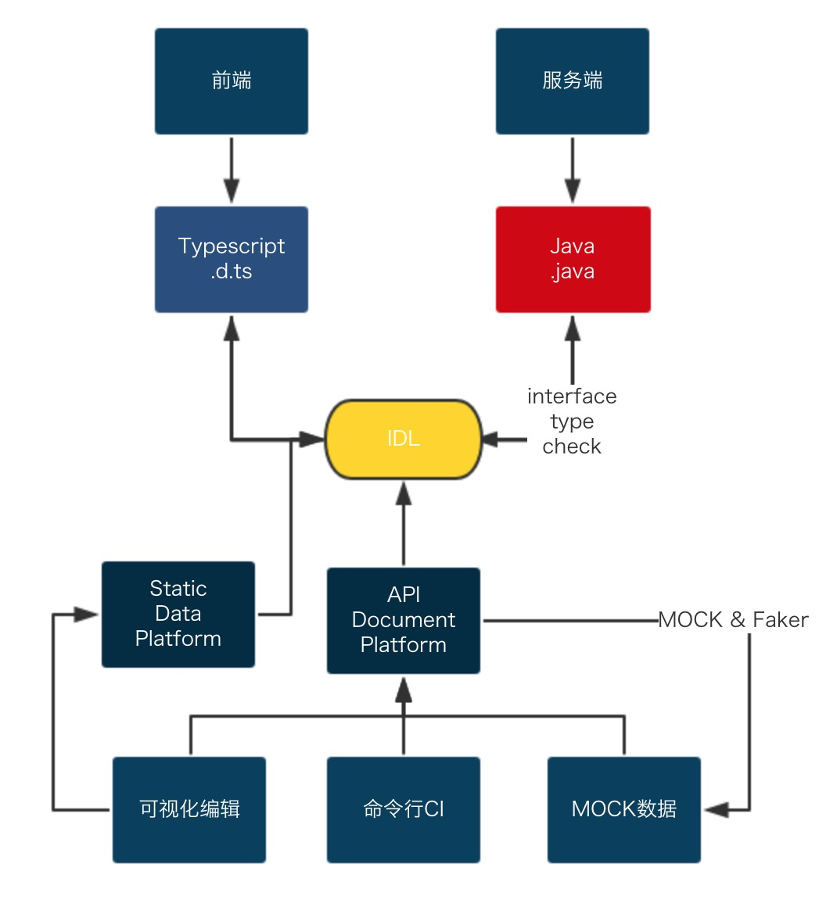

# ADP

> API Document Platform

### 需求背景

> 开发流程中，联调是效率低且耗时的过程
> 规范的团队会编写接口文档，但效率以及修改后同步并不能很好的解决
> 于是自动化解决前后端接口定义来了，相当于釜底抽薪，可以从根源上解决两端不对齐的问题

- Java / C# ⇒ Typescript 转换库
    - 独立项目
    - 易扩展
    - 方便单测
- Transform
    - 可视化操作
    - 配置文件
    - CI一键生成

### 技术方案

- IDL
- Adapter + Transform